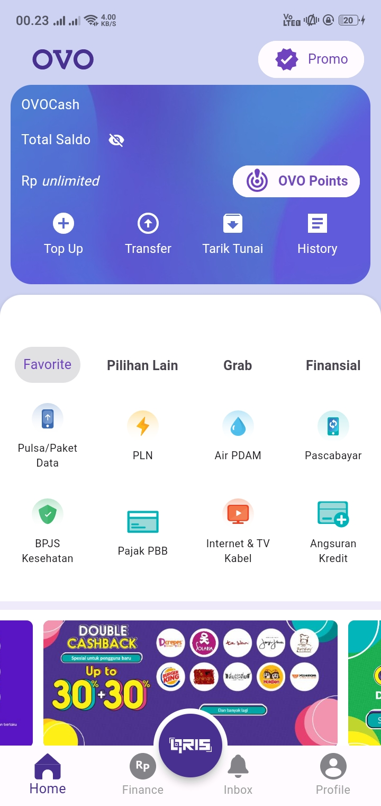
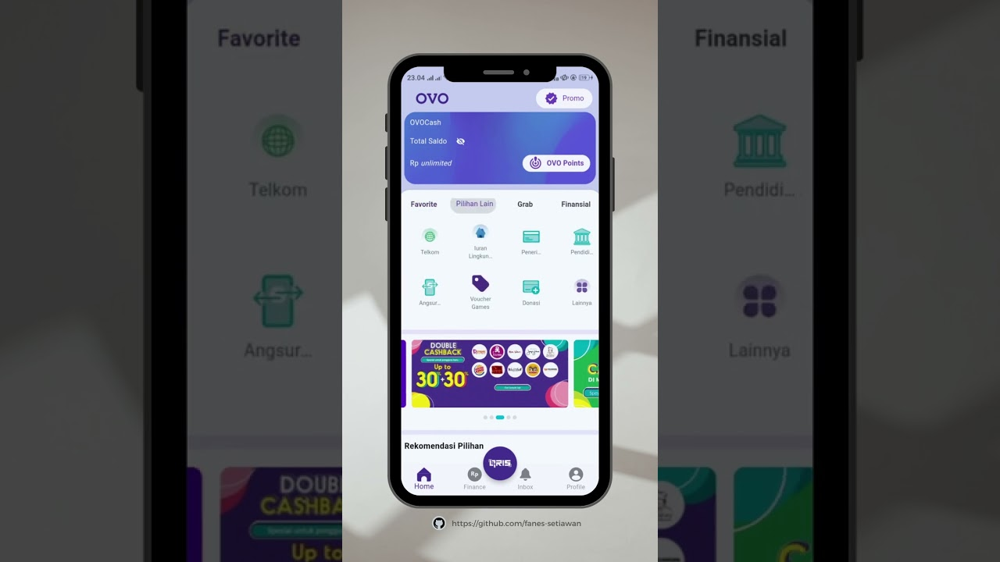

# UI Aplikasi OVO dengan Flutter



## Deskripsi Proyek

Proyek ini adalah replika UI aplikasi OVO menggunakan Flutter, sebuah framework pengembangan aplikasi mobile berbasis Dart. Aplikasi ini dibuat dengan arsitektur Model-View-Controller (MVC) untuk mengorganisasi kode dengan lebih terstruktur dan terpisah.

Dalam proyek ini, saya berfokus pada desain tampilan dan pengaturan antarmuka pengguna aplikasi OVO, seperti halaman Beranda, Finansial, Bayar, Kotak Masuk, dan Profil. Aplikasi ini hanya menampilkan desain statis tanpa interaksi dengan backend atau data API.

## Video Demo

<<<<<<< HEAD
Klik tautan di bawah ini untuk melihat video demo Swagger UI aplikasi OVO menggunakan Flutter.
=======
Klik di bawah ini untuk melihat video demo UI aplikasi OVO menggunakan Flutter.
>>>>>>> de6efbd (add description to README.md)

[](https://www.youtube.com/watch?v=mn4trIe5zQM)

## Cara Menjalankan Proyek

Untuk menjalankan proyek ini, pastikan Anda telah menginstal Flutter SDK dan mengonfigurasi lingkungan kerja Anda. Berikut adalah langkah-langkahnya:

1. Pastikan Anda telah menginstal Flutter SDK dan mengatur variabel lingkungan PATH untuk Flutter di sistem Anda. Panduan instalasi Flutter dapat ditemukan di situs resmi Flutter.

2. Buka terminal atau command prompt dan arahkan ke direktori proyek ini.

3. Jalankan perintah `flutter pub get` untuk mengunduh dan menginstal dependensi proyek.

4. Hubungkan perangkat fisik atau emulator Android/iOS ke komputer Anda.

5. Jalankan perintah `flutter run` pada terminal untuk menjalankan aplikasi di perangkat terhubung atau emulator.

   ```bash
   flutter pub get
   flutter run
